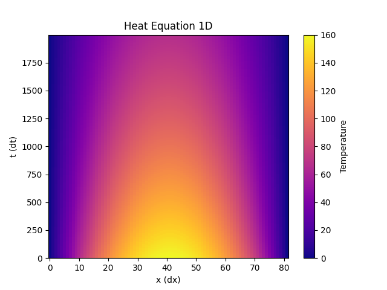
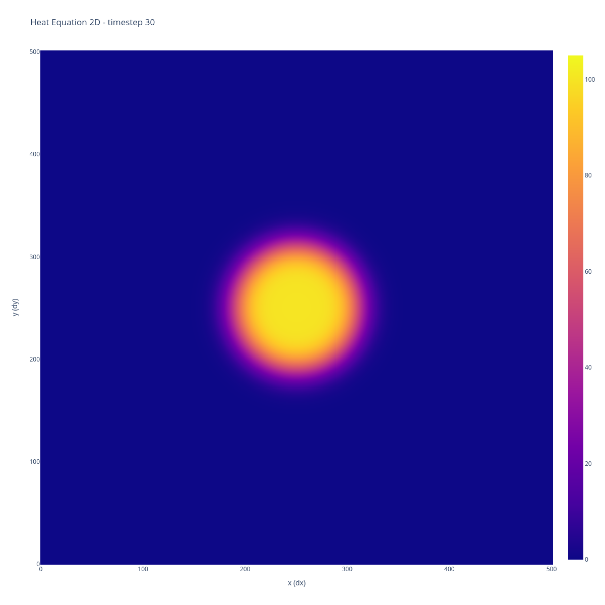
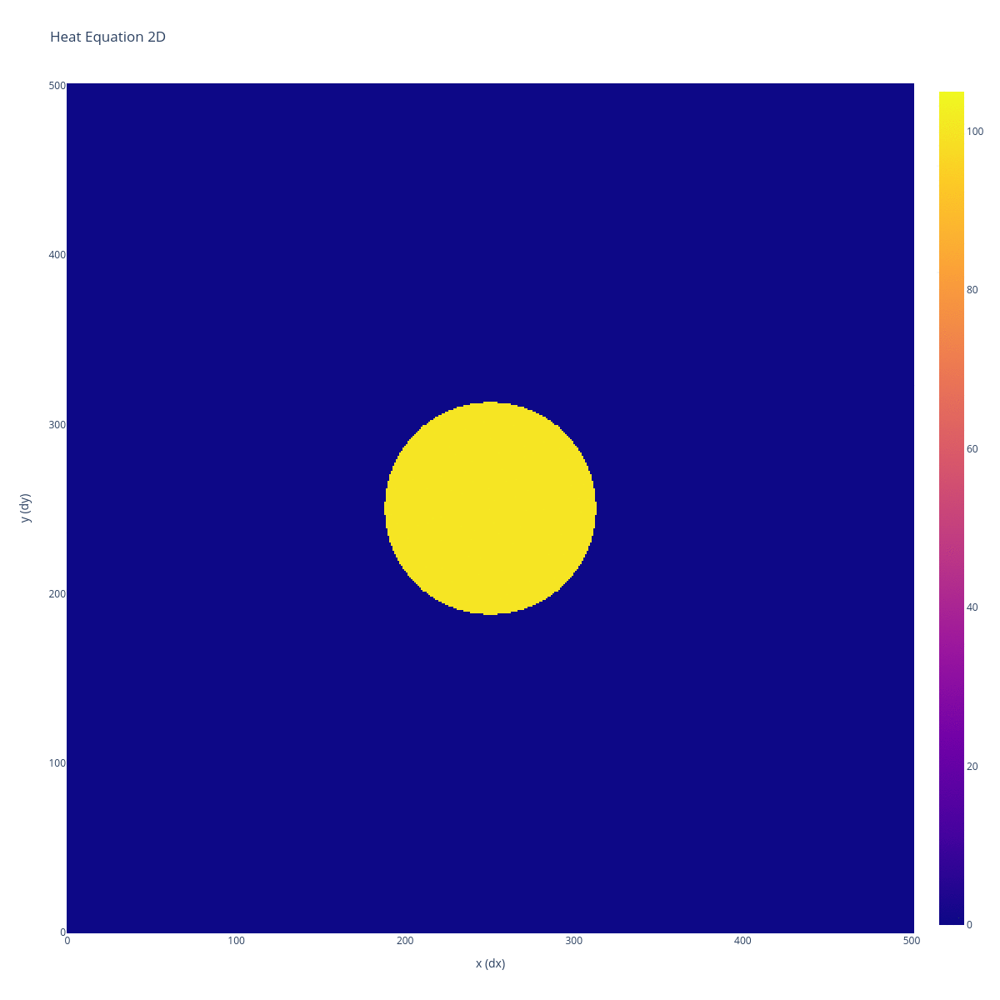
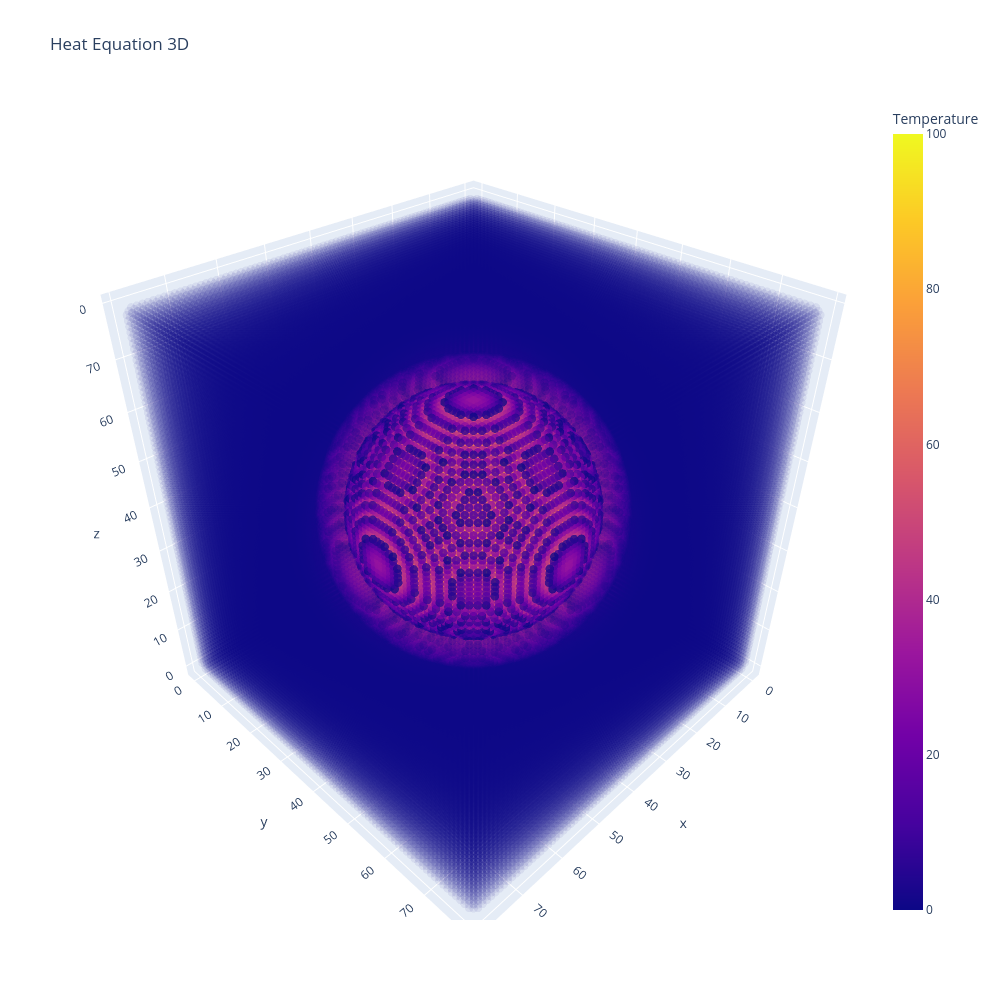

# Heat Equation

This repository provides basic heat equation codes in C++ for 1, 2 and 3 dimensions. It uses finite-difference discretization using the Taylor-Young formula with periodic boundary conditions.

## Compilation

```bash
make
./heat_1d
./heat_2d
./heat_3d
```

## Build and run

```bash
make
./heat_1d -x 100 -t 2000 -o data1D_100x_2000t.txt
./heat_2d -x 500 -y 500 -t 3000 -d 1.272e-4 -w 100 -o data2D_gold_500xy_3000t.txt
./heat_3d -x 80 -y 80 -z 80 -t 5000 -d 1.272e-4 -w 100 -o data3D_gold_80xyz_5000t.txt
```

Above are three examples :
- A 100 points simulation over 2000 timesteps with output to `data1D_100x_2000t.txt`
- A 500 by 500 points simulation of 3000 timesteps, for a gold material (thermal diffusivity of 1.272e-4), with output each 100 timesteps to `data2D_gold_500xy_3000t.txt` (31 data dumps)
- A 80 by 80 by 80 points simulation of 5000 timesteps for a gold material(thermal diffusivity of 1.272e-4), with output each 100 timesteps to `data3D_gold_80xyz_5000t.txt` (50 data dumps)


## Usage

The procedure is the same for all dimensions. Let's say X dimension (replace X with a number between 1 to 3)

```bash
# Compile the code
$ make heat_Xd
# Execute
$ ./heat_Xd
# Visualise
$ python3 plot_Xd.py [output.txt]
$ python3 out_to_paraview_Xd.py [output.txt]
```

## Visualisation
After executing one heat_equation code for the dimension X, execute the `plot_Xd.py` with the output filename resulting from the simulation


### visualizing 1 Dimension
```bash
# Example for 1 dimension
$ make heat_1d
$ ./heat_1d -x 100 -t 2000 -o data1D_100x_2000t.txt
Configuration : 
    ...
Results written to data1D_100x_2000t.txt

$ python3 plot_1d.py data1D_100x_2000t.txt
```



### visualizing 2 Dimensions
```bash
# Example for 2 dimensions
$ make heat_2d
$ ./heat_2d -x 500 -y 500 -t 3000 -d 1.272e-4 -w 100 -o data2D_gold_500xy_3000t.txt
Configuration : 
    ...
Results written to data2D_gold_500xy_3000t.txt

$ python3 plot_2d.py data2D_gold_500xy_3000t.txt
$ open frames_data2D_gold_500xy_3000t.txt/frame_0030.png
```



Make it a gif !

```bash
$ python3 plot_2d.py data2D_gold_500xy_3000t.txt
...
Export heatmap frames to folder "frames_data2D_gold_500xy_3000t.txt"
Exporting animation frames complete.

# ImageMagick is required
$ cd frames_data2D_gold_500xy_3000t.txt
$ convert -delay 10 -loop 0 *.png output.gif
```



### visualizing 3 Dimensions

```bash
# Example for 3 dimensions
$ make heat_3d
$ ./heat_3d -x 80 -y 80 -z 80 -t 5000 -d 1.272e-4 -w 100 -o data3D_gold_80xyz_5000t.txt
Configuration : 
    ...
Results written to data3D_gold_80xyz_5000t.txt

$ python3 plot_3d.py data3D_gold_80xyz_5000t.txt
$ open heatmap_3d.png
```



<!-- Make it a gif ! -->

Better visualise it with Paraview ..
> It currently uses CSV files, which isn't ideal, and it should be updated to use VTK files at some point.

```bash
$ py out_to_paraview_3d.py data3D_gold_80xyz_5000t.txt
Simulation dimensions are 80 x 80 x 80
Simulation has 50 steps
80 80 80 512000 512000
...
CSV files written to "csv_data3D_gold_80xyz_5000t.txt/"

$ ls csv_data3D_gold_80xyz_5000t.txt/
data3D_gold_80xyz_5000t.txt_000.csv
...
data3D_gold_80xyz_5000t.txt_049.csv
```

Open Paraview :
- open the `csv_data3D_gold_80xyz_5000t.txt/data3D_gold_80xyz_5000t.txt_..csv` group, select **CSV reader** and leave default settings, click apply
- add a **TableToStructuredGrid** filter on `data3D_gold_80xyz_5000t.txt_00*`, 
- on **whole extent**, set on the right column of the table the dimensions of the simulation, minus one (eg. here it will be 79 79 79 on right column).
- on **x,y,z columns**, set x, y, z
- on representation set to **Volume** for example, and **t** for coloring and click apply


